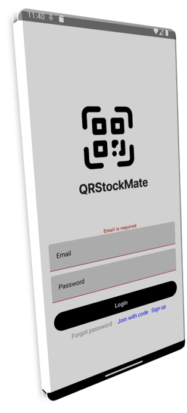
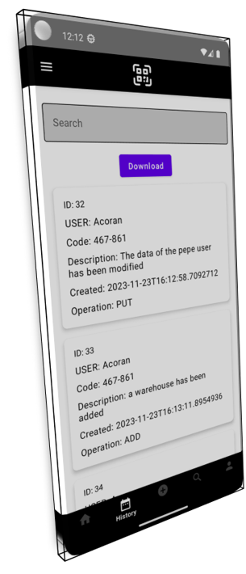
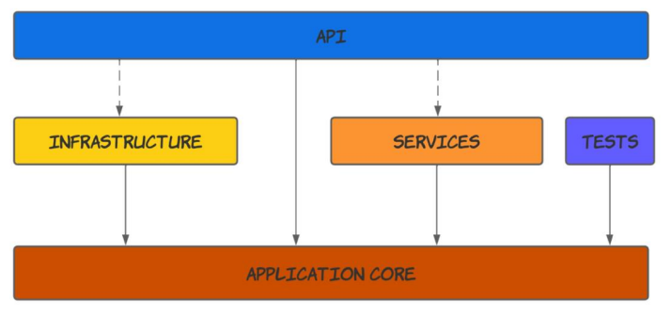

 <h1 align="center">QRStockMate
 </h1>

 
  
 

## Contenido

 

  <h3>1.Presentación</h3>
  <h3>2.Funciones</h3>
  <h3>3.Arquitecturas<h3>
  <h3>4.Ejecución</h3>
  <h3>5.Notas</h3>
 

## 1. Presentacion
En el mundo actual, la tecnología desempeña un papel fundamental en la gestión
eficiente de productos y almacenes. La necesidad de optimizar los procesos de
inventario, seguimiento de productos y gestión de almacenes ha llevado al desarrollo de
soluciones innovadoras. En este contexto, se presenta una propuesta para una aplicación
móvil que revolucionará la forma en que se añaden productos y se gestionan almacenes
a través de la utilización de códigos QR. Esta aplicación, QRStockMate, está diseñada
para cubrir las necesidades de diversos roles dentro de una organización, ofreciendo
funcionalidades específicas para cada uno de ellos.

La aplicación que estamos desarrollando es un completo sistema de gestión de
almacenes diseñado para empresas de cualquier tamaño. Esta herramienta permitirá a
las empresas controlar de manera eficiente y precisa sus inventarios, supervisar la
ubicación de los productos dentro de cada almacén y simplificar las tareas de adición y
actualización de productos utilizando la tecnología de escaneo de códigos QR.

## 2. Funcionalidades
La funcionalidad clave de esta aplicación se basa en el uso de códigos QR, que actúan
como una interfaz rápida y precisa para añadir y rastrear productos en almacenes.\

Registro de Productos:\
• Permite registrar nuevos productos en el inventario, incluyendo información como
nombre, descripción, localización, fecha de entrada, stock.\

CRUD de Almacenes:\
• Permite gestionar almacenes relacionados con la empresa, incluyendo
información como nombre, localización, administradores, organización.\

Lectura de Códigos QR:\
• Permite escanear códigos QR de productos para obtener información instantánea
sobre el producto y gestionarlos.\

Entrada y Salida de Productos:\
• Permite registrar la entrada y salida de productos en el inventario, actualizando la
cantidad disponible.\

Historial de Transacciones:\
• Permite generar informes de todas las operaciones realizadas en la aplicación para
facilitar la auditoría.\

Búsqueda y Filtros:\
• Permite buscar productos por nombre, código de barras o cualquier otro criterio
relevante.\

Información Detallada del Producto:\
• Proporciona información detallada sobre cada producto incluyendo nombre,
descripción, localización, fecha de entrada.\
Seguridad y Acceso Controlado:\

• Proporciona acceso seguro a la aplicación a través de autenticación.
• Administra diferentes niveles de permisos de usuario para garantizar un acceso
adecuado a las funcionalidades.\

Gestión de Almacenes Centralizada:\
• Proporciona una visión general de todos los almacenes gestionados, permitiendo
a los usuarios seleccionar un almacén específico para acceder a sus detalles y
funciones.

## 3. Arquitecturas

### Backend (Arquitectura Limpia):

### Cliente (Arquitectura de App Típica):

## 4. Ejecución

Para observar la funcionlidades en la app vease los siguientes documentos:
<ul>
    <li><a href="https://github.com/AcoranGonzalezMoray/AplicacionesMovilesNativas/blob/main/Sprint_1/Sprint_1%20(4).pdf">Sprint 1</a></li>
    <li><a href="https://github.com/AcoranGonzalezMoray/AplicacionesMovilesNativas/blob/main/Sprint_2/Sprint%202%20(1).pdf">Sprint 2</a></li>
</ul>

Para observar el proyecto completo vease la siguiente presentación:
<ul>
    <li><a href="https://github.com/AcoranGonzalezMoray/AplicacionesMovilesNativas/blob/main/Presentaciones/Presentacion%20QRStockMate%20(1).pptx">Presentación</a></li>
</ul>

## 5. Notas

Para más información de todo el proceso visite el siguiente repositorio:
<ul>
    <li><a href="https://github.com/AcoranGonzalezMoray/AplicacionesMovilesNativas/tree/main">Informes</a></li>
</ul>
